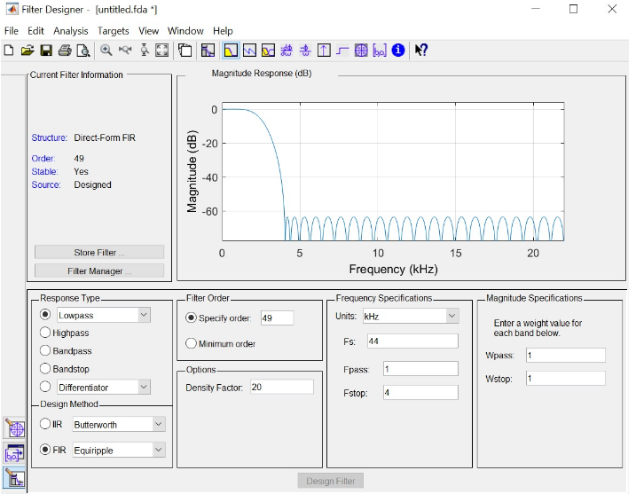

# Digital Signals
Here I learned some digital signal processing. I built a simple circuit with 7 LEDs that connect to 7 pins. 

## What does this even do??
Volume_Measurement is a volume visualizer. The louder the input sound, the more LEDs light up.  
Frequency_Search is a frequency visualizer. It uses the discrete fourier transform from DFT to convert the sound into frequency and based on it different LEDs light up.

### DFT filter
I used MATLAB's filter designer to create the filter and then export it. Here is the configuration:

## Build
If you want to build this for some reason you will need a Microcontroler (I used TM4C123G Evaluation board), 7 LEDs and 7 resistors to not fry your LEDs. If you did it correctly the LEDs should light up in the order 5-1-3-8-5-7-2-4-6-3 when putting DFT_test_SS23.wav as an input sound.
