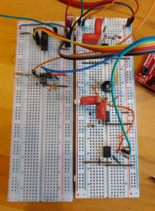

# Filters
Learning SPICE and basic analog filters. The adder with converter was built on a breadboard and a speaker was hooked up to it (not in the picture). When a sound signal was put through the filter, the bass amount (low frequencies) could be controlled with the potentiometer.

