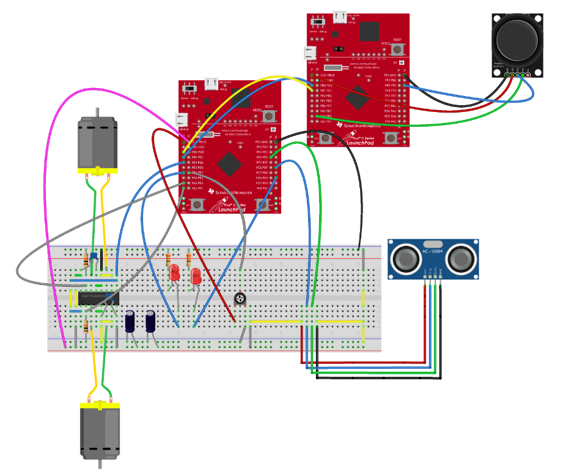

# Magni
Magni is a small industrial robot designet to carry heavy loads. The test prototype for the project required to use the following parts:
<table>
<tr>
    <th>Count</th>
    <th>Part</th>
</tr>
<tr>
    <th>2</th>
    <th>Tiva™ C Series TM4C123G LaunchPad Evaluation Board</th>
</tr>
<tr>
    <th>2</th>
    <th>3V DC motors</th>
</tr>
<tr>
    <th>1</th>
    <th>H-Bridge SN754410</th>
</tr>
<tr>
    <th>1</th>
    <th>Ultrasonic sensor HC-SR04</th>
</tr>
<tr>
    <th>1</th>
    <th>Joystick</th>
</tr>
<tr>
    <th>5</th>
    <th>Resistors (330 - 100kOhm)</th>
</tr>
<tr>
    <th>4</th>
    <th>Condensators (100nF - 100muF)</th>
</tr>
<tr>
    <th>2</th>
    <th>LED</th>
</tr>
</table>

The software includes drivers for the ultrasonic sensor, ADC, PWM, UART and Joystick steering. The first evaluation board receives analog data from the joystick, converts it with the ADC and sends it to the second one through UART. The second acts as a controller to the motors and receiver for the ultrasonic sensor.

