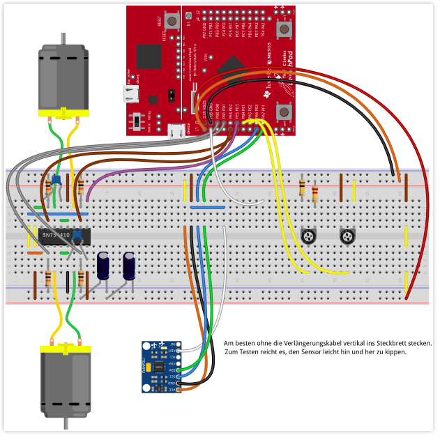

# Segway
Segway is a well known device for transportation. It consists of 2 wheels and a handle. The motors actuating the wheels are controlled with the position of the handle. To simulate the hardware the following parts were used to build a prototype:
<table>
<tr>
    <th>Count</th>
    <th>Part</th>
</tr>
<tr>
    <th>1</th>
    <th>Tiva™ C Series TM4C123G LaunchPad Evaluation Board</th>
</tr>
<tr>
    <th>2</th>
    <th>3V DC motors</th>
</tr>
<tr>
    <th>1</th>
    <th>H-Bridge SN754410</th>
</tr>
<tr>
    <th>1</th>
    <th>6-axis Movement sensor MPU 6050</th>
</tr>
<tr>
    <th>11</th>
    <th>Resistors (1kOhm - 1MOhm)</th>
</tr>
<tr>
    <th>4</th>
    <th>Condensators (100nF - 100muF)</th>
</tr>
</table>

The software includes drivers for the movement sensor, ADC, PWM, Timer and Battery protection. The board receives position data from the sensor and controls the motors based on the readings. The frequency of the readings can be set with the timer driver. If the duty cycle of the motors is 100% for too long, the battery safety management module triggers and stops all processes. 

